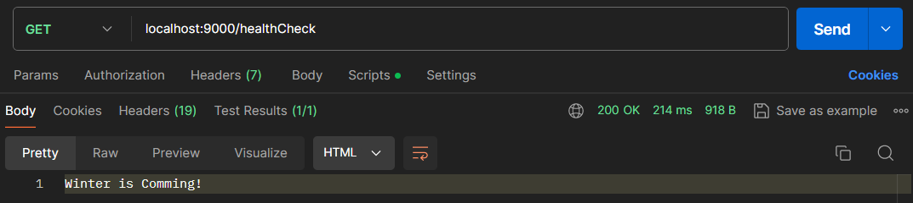

# Authenticator Service

Este é um micro serviço desenvolvido com o objetivo de lidar com usuários de um sistema, sendo possível cria-los, atualiza-los, remove-los e autentica-los através desta aplicação.

# Tecnologias Utilizadas
- Node.js
- Typescript
- JsonWebToken (JWT)
- Bcrypt
- PostgreSQL
- Redis
- Docker


# Preparando o Ambiente
Para execuat essa aplicação será necessário ter o [Docker](https://docs.docker.com/engine/install/) instalado em sua máquina, apa assim executar containers do PostgreSQL, Redis e da aplicação. Caso já tenha em seu ambiente estas tecnologias precisará apenas rodar a aplicação apontando para elas conforma será mencionado na configuração do arquivo .env.

### Redis com Docker
Instale o Redis com o seguinte comando no seu terminal:
```json
docker pull redis
```
Execute o redis em um conteiner passando uma senha substituindo <**senha do seu redis**>:
```json
docker run -d --name redis_container -p 6379:6379 redis:latest redis-server --requirepass <senha do seu redis>
```

### PostgreSQL com Docker
Instale o PostgreSQL com o seguinte comando no seu terminal:
```json
docker pull postgres
```
Execute o postgres em um conteiner passando uma senha substituindo <**senha do seu postgres**>:
```json
docker run --name postgres_container -e POSTGRES_PASSWORD=<senha do postgres> -d postgres
```

### Variáveis de Ambiente
Para executar a aplicação voce precisará configurar as variáveis de ambiente do projeto como porta do servidor, credenciais do banco e etc. Para isso voce tem um arquivo .env.example na raiz do projeto, renomeie este arquivo para .env e insira suas variáveis, por exemplo:
```json
PORT="9000"

DB_PORT="5432"
DB_HOST="172.20.10.5"
DB_NAME="mydb"
DB_SCHEMA="myschema"
DB_USER="postgres"
DB_PASSWORD="mypassword123"

REDIS_PORT="6379"
REDIS_HOST="172.20.10.5"
REDIS_USER=""
REDIS_PASSWORD="mypassword123"
```

### Execute a Aplicação
Crie a imagem da aplicação com o seguinte comando:
```json
docker build -t auth_service .
```
Execute a Aplicação com o comando:
```json
docker run -p 9000:9000 auth_service
```

# API REST
Depois de executar as etapas anteriores podemos validar se a aplicação esta realmente funcionando, para isso temos um rota de healthCheck, use o [Postman](https://www.postman.com/downloads/) para testar os endpoints da aplicação. Na raiz do projeto tem uma collection do postman para ser utilizada, assim não será necessário criar as requisições, basta importa-la no seu postman.

### HealthCheck
Se sua aplicação estiver de pé, deverá ter esse resultado na request:


Sendo assim você tem uma aplicação funcionando perfeitamente e pode explorar as outras funcionalidades, siga a collection do Postman e crie seus usuários, atualize, remova, faça login e logout, olhe seus bancos postgres e redis.
